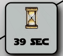
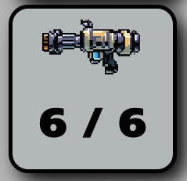
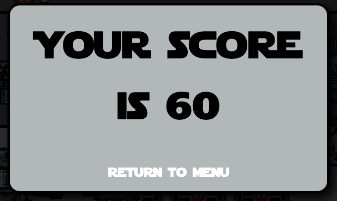

# Blaster Battles: Galactic Showdown

Blaster Battles: Galactic Showdown is a First Person Light Gun shooter set in the Star Wars universe. As the Rebel Alliance faces a new deadly weapon deployed by The Empire, you must team up with your trusty droid instructor to save the Galaxy!  
[Play the deployed game](https://will-griffiths-ireland.github.io/Star-Wars-Rebel-Alliance-Negotiation-Simulator/)

## Contents
* [How to Play](#how-to-play)
* [Features](#features)
* [Typography](#typography)
* [Technologies Used](#technologies-used)
* [Installation and Setup](#installation-and-setup)

## How to Play:

Select a stage and get ready for action!

Your score is based on 10 points per target hit and then multiplied by your remaining time.

### Controls

#### Computer:

- Aim – Mouse

- Shoot – Mouse Click

#### Mobile:

*To play on mobile, please rotate the screen to landscape., as this game is optimised for 16/9*

- Shoot - Tap

## Features:

The intro is the iconic intro from the film thats on top of multiple star layers.

The menu provides access to the level select, play guide, and team credits and has a custom cursor and lightsaber theme.

The timer plays a critical role in the game and a big part of the players score as it acts as the multiplier. It has an animated sand timer to keep the player aware that the clock is ticking. When it hits zero it's game over.

The gameplay area shows the players current score, blaster ammo level, and timer. These are along the center and right of the screen.

The score shows how many targets the play has hit out of the total on the level.
The blaster ammo level is not only a visual but acts as a reload button when the play is out of charges. This was to avoid spam clicking shots. The area pulses in red when you need to reload. Theree is also an audio noise for reloading.
When the blaster has ammo and the player clicks it will fire a shot and be heard, if out of ammo the empty charge sounds plays.

Onscreen objects are mostly destructable but this can be changed when objects are placed.
When targets or objects are hit by the blaster they are destroyed and the players score increases(if target hit) and blaster ammo goes down.

Annimations are configurable in placement functions and add to the difficulty of the game. The wookie dancers will be in the next release.

The droid instructer spurts out random lines depending on the players actions such as hitting the target or not reloading.

Once the player hits all targets (or the timer runs down) then the game over screen displays the score and option to return to the main menu.

## Typography:
- Title Font - [Press Start 2P](https://fonts.google.com/specimen/Press+Start+2P)
- Main Font - [Star Jedi Font](https://www.dafont.com/star-jedi.font)

## Technologies Used:

### Languages:
- HTML
- CSS
- JavaScript

### Tools:

- Bing AI - Generate Image Sprites
- Paint.net - Edit Image Sprites
- GIMP - Mockup Design
- GitHub - Version Control
- GitPod - Cloud Development
- ChatGPT - Droid Narration Dialogue (Nearly all chatgpt dialog removed and Will dialog added LOL )
- Powerpoint - Mocks and Backgrounds
- Audacity - Sounds Effects

### Media:
- [Hero Sprites](https://www.clipartmax.com/middle/m2i8b1i8m2A0m2Z5_starwars-fandoms-pixel-art-yoda-chewbacca-darth-vader-r2d2-fighting-game-pixel/)
- [Space Background image](https://i.pinimg.com/originals/1e/64/c3/1e64c3289a248160c26a3b57b221e282.png)
- [Star Destroyer Hallways](https://www.artstation.com/artwork/8l3KYR)
- Sounds effects - Will Voice edited in Audacity
- Music tracks (Pixabay) - want to add function to display track name and credit in game (future improvement)

## Installation and Setup
To run Blaster Battles: Galactic Showdown, simply click the following link. The game runs entirely in your web browser. There is no need to install any software or dependencies.

[Play the deployed game](https://will-griffiths-ireland.github.io/Star-Wars-Rebel-Alliance-Negotiation-Simulator/)

